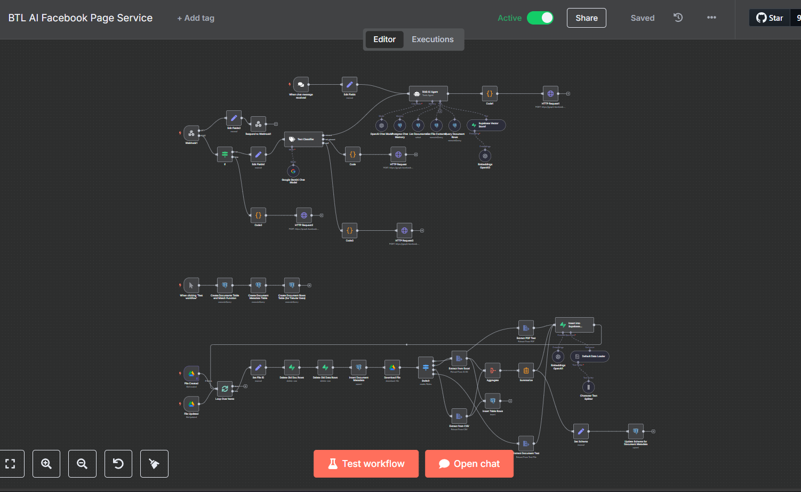
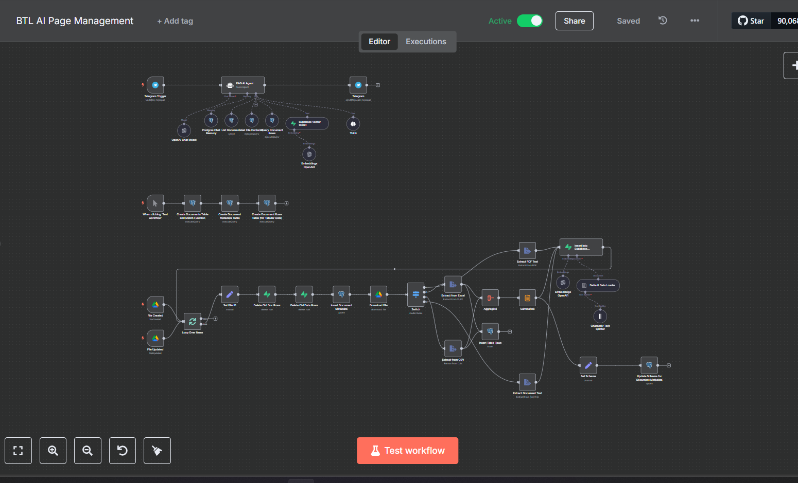

# BTL AI - Hệ thống Quản lý Thông minh Tích hợp AI

Hệ thống quản lý thông minh tích hợp AI dành cho doanh nghiệp, tự động hóa dịch vụ khách hàng, quản lý trang Facebook, và theo dõi kho hàng.

## Tổng quan Dự án

BTL AI là một hệ thống quản lý toàn diện cho doanh nghiệp, kết hợp công nghệ AI tiên tiến để tự động hóa các quy trình kinh doanh. Hệ thống tận dụng các mô hình ngôn ngữ lớn (LLM), trí tuệ nhân tạo và tự động hóa quy trình để cung cấp:

- Dịch vụ khách hàng tự động trên Facebook
- Quản lý thông tin và nội dung trang Facebook
- Theo dõi tồn kho và báo cáo
- Phân tích doanh thu và xu hướng kinh doanh

## Cấu trúc Dự án

Dự án được tổ chức với các thành phần chính sau:

### Quy trình Tự động hóa và API

- **BTL_AI_Facebook_Page_Service.json**: Quy trình n8n để quản lý dịch vụ khách hàng trên Facebook
- **BTL_AI_Page_Management.json**: Quy trình n8n để quản lý nội dung và thông tin trang Facebook
- **customer_sevice.json**: Cấu hình API cho hệ thống dịch vụ khách hàng
- **page_management.json**: Cấu hình API cho hệ thống quản lý trang

### Dữ liệu và Báo cáo

- **grocery_product.xlsx**: Danh sách sản phẩm và thông tin hàng hóa
- **daily_revenue_report.xlsx**: Báo cáo doanh thu hàng ngày
- **monthly_product_revenue.xlsx**: Báo cáo doanh thu theo sản phẩm hàng tháng
- **inventory_alert.txt**: Cảnh báo tồn kho và đề xuất hành động

### Cấu hình

- **key.txt**: Chứa khóa API và thông tin xác thực
- **profile.pdf**: Tài liệu thông tin về hồ sơ người dùng/doanh nghiệp

## Tính năng Nổi bật

### 1. Dịch vụ Khách hàng AI

- **Hội thoại Tự nhiên**: Sử dụng OpenAI API để xử lý và phản hồi tin nhắn khách hàng trên Facebook
- **Bộ nhớ Hội thoại**: Lưu trữ và duy trì lịch sử trò chuyện với khách hàng qua PostgreSQL
- **Phân tích Ngữ cảnh**: Phân tích và hiểu ngữ cảnh câu hỏi của khách hàng
- **Tích hợp Tài liệu**: Kết nối với tài liệu trên Google Drive để trả lời dựa trên thông tin sản phẩm/dịch vụ

### 2. Quản lý Trang Facebook

- **Theo dõi Tương tác**: Theo dõi và quản lý bình luận, tin nhắn trên trang Facebook
- **Tự động Phản hồi**: Tự động phản hồi cho các truy vấn phổ biến
- **Quản lý Nội dung**: Hỗ trợ việc tạo và lên lịch nội dung
- **Phân tích Hiệu suất**: Theo dõi hiệu suất bài đăng và tương tác

### 3. Quản lý Kho hàng

- **Cảnh báo Tồn kho**: Tự động thông báo khi hàng hóa xuống dưới ngưỡng
- **Đề xuất Mua hàng**: Đề xuất số lượng nhập hàng dựa trên dữ liệu lịch sử
- **Phân tích Sản phẩm Bán chạy**: Xác định và theo dõi sản phẩm bán chạy
- **Chiến lược Giảm tồn kho**: Đề xuất chiến lược giảm giá cho hàng tồn kho lâu

### 4. Phân tích Doanh thu

- **Báo cáo Doanh thu Hàng ngày**: Theo dõi doanh thu theo ngày
- **Phân tích Doanh thu Sản phẩm**: Phân tích hiệu suất sản phẩm theo tháng
- **Dự báo Xu hướng**: Phân tích xu hướng và dự báo doanh thu

## Công nghệ

### AI và Xử lý Ngôn ngữ Tự nhiên

- **OpenAI API**: Sử dụng GPT cho xử lý ngôn ngữ tự nhiên nâng cao
  - Mô hình Chat: Cung cấp trả lời hội thoại tự nhiên
  - Embedding: Đánh chỉ mục và tìm kiếm ngữ nghĩa trong tài liệu
  - Mô hình sử dụng: text-embedding-3-small và các mô hình chat của OpenAI

- **LangChain**: Framework để phát triển ứng dụng dựa trên LLM
  - Bộ nhớ hội thoại: Lưu trữ ngữ cảnh hội thoại
  - Tải tài liệu: Xử lý và phân chia tài liệu
  - Xử lý Chuỗi: Xây dựng chuỗi quy trình AI phức tạp

### Tự động hóa và Quy trình làm việc

- **n8n**: Nền tảng tự động hóa quy trình làm việc
  - Kích hoạt: Kích hoạt dựa trên sự kiện như file được tạo/cập nhật
  - Kết nối: Tích hợp giữa Google Drive, OpenAI và Facebook
  - Xử lý dữ liệu: Xử lý và chuyển đổi dữ liệu giữa các hệ thống

### Cơ sở dữ liệu và Lưu trữ

- **PostgreSQL**: Lưu trữ lịch sử hội thoại và dữ liệu người dùng
- **Supabase**: Lưu trữ và truy vấn tài liệu được nhúng (embedded documents)
- **Google Drive**: Lưu trữ và quản lý tài liệu

### Tích hợp API

- **Google Drive API**: Tương tác với tài liệu và file
- **Facebook Graph API**: Quản lý tương tác trên Facebook
- **Supabase API**: Quản lý dữ liệu và truy vấn

## Hướng dẫn Sử dụng

### Thiết lập Ban đầu

1. **Cấu hình API Key**:
   - Đảm bảo các khóa API trong `key.txt` được cập nhật
   - Thiết lập xác thực Google Cloud cho Google Drive

2. **Cấu hình Cơ sở dữ liệu**:
   - Thiết lập PostgreSQL với bảng hội thoại
   - Cấu hình Supabase để lưu trữ tài liệu embedded

3. **Thiết lập n8n**:
   - Nhập quy trình từ file JSON (`BTL_AI_Facebook_Page_Service.json` và `BTL_AI_Page_Management.json`)
   - Cấu hình các kết nối cho Google Drive, OpenAI và Facebook

### Quản lý Tài liệu

1. **Tài liệu Sản phẩm/Dịch vụ**:
   - Tải tài liệu lên thư mục Google Drive được chỉ định
   - Hệ thống sẽ tự động trích xuất văn bản và tạo embedding

2. **Cập nhật Tài liệu**:
   - Cập nhật tài liệu trong Google Drive
   - Hệ thống sẽ tự động phát hiện thay đổi và cập nhật embedding

### Quản lý Dịch vụ Khách hàng

1. **Thiết lập Webhook**:
   - Cấu hình webhook Facebook để gửi sự kiện tới n8n
   - Xác thực webhook bằng tokens trong file key.txt

2. **Quản lý Phản hồi**:
   - Hệ thống sẽ tự động phản hồi tin nhắn trên Facebook
   - Xem lịch sử hội thoại trong cơ sở dữ liệu PostgreSQL

### Quản lý Kho hàng và Báo cáo

1. **Theo dõi Tồn kho**:
   - Cập nhật file inventory để theo dõi số lượng tồn kho
   - Xem báo cáo cảnh báo tồn kho trong `inventory_alert.txt`

2. **Phân tích Doanh thu**:
   - Cập nhật dữ liệu doanh thu trong các file Excel
   - Xem báo cáo doanh thu hàng ngày và hàng tháng

## Bảo mật

- **Bảo vệ API Key**: Đảm bảo file `key.txt` được bảo vệ và không chia sẻ công khai
- **Xác thực OAuth**: Sử dụng OAuth 2.0 cho xác thực Google Drive
- **Mã hóa dữ liệu**: Đảm bảo dữ liệu nhạy cảm được mã hóa trong cơ sở dữ liệu

## Yêu cầu hệ thống

- **n8n**: Phiên bản mới nhất
- **PostgreSQL**: Phiên bản 13 trở lên
- **Node.js**: Phiên bản 14 trở lên
- **Tài khoản Google Cloud** với Google Drive API được kích hoạt
- **Tài khoản OpenAI** với quyền truy cập API
- **Tài khoản Facebook Developer** với quyền truy cập Graph API
